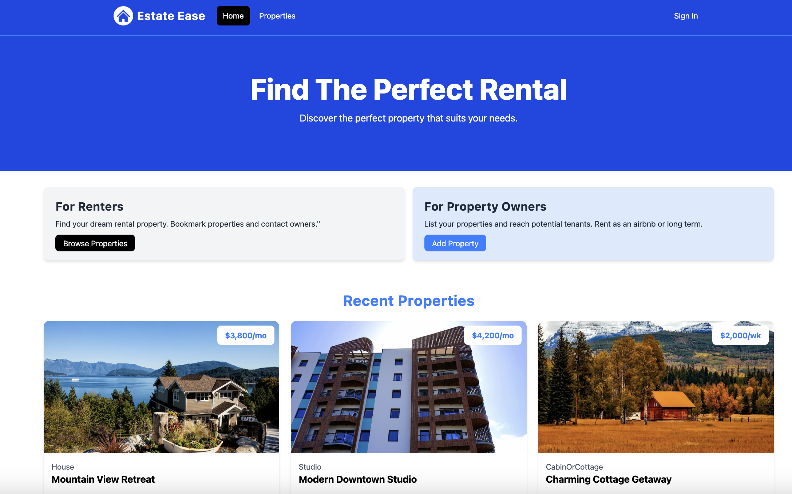

# Estate Ease Real Estate Platform
> A full stack web application to help you search for your next rental property.



## Features

- User authentication with Google & Next Auth
- User authorization
- User profile with user listings
- Property Listing CRUD
- Property image upload (Multiple) with Cloudinary
- Property search
- Internal messages with 'unread' notifications
- Photoswipe image gallery
- Property bookmarking / saved properties
- Property sharing to social media

## Technologies Used
  <p>
      <a href="#"></a>
      <a href="#"></a>
      <a href="#"></a>
      <a href="#"></a>
      <a href="#"></a>
  </p>

## Usage

- Create [MongoDB](https://www.mongodb.com/) Atlas account and a cluster.
- Create [Cloudinary](https://cloudinary.com/) account. 

Add a `.env` file in the `backend/propertyapp/src/main/resources` and add the following

```
MONGO_DATABASE= YOUR MONGO DB NAME
MONGO_URI= YOUR MONGO DB URI
CLOUDINARY_URL= YOUR CLOUDINARY API KEY
```

### Install Dependencies

```bash
cd frontend/
npm install
```

### Run the Frontend Development Server

```bash
cd frontend/
npm run dev
```

### Run the Backend Development Server

```bash
cd backend/
./mvnw spring-boot:run
```

Open [http://localhost:5173](http://localhost:5173) with your browser to see the result.

## License

This project is licensed under the MIT License
